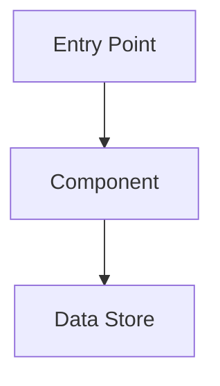

# Document Template

The following template is a starting point. Omit sections that don't apply,
add sections for unique aspects, and adjust the structure to best serve the
target audience.

````markdown
# [Feature/System Name] Architecture

## Overview

[1-2 paragraph summary of what this feature/system does and why it exists]

## Architecture Diagram



## Components

### [Component Name]

**Purpose**: [What it does]

**Location**: `path/to/file.ext`

**Key Functions**:
- `functionName()` - Brief description
- `anotherFunction()` - Brief description

**Interactions**:
- Receives input from: [Component]
- Sends output to: [Component]

## Data Flow

[Description of how data moves through the system, from input to output]

## Configuration

[How features are enabled, disabled, or configured. Include file paths and
environment variables.]

## Code References

| Component | File | Key Symbols |
|-----------|------|-------------|
| Auth | `src/auth/index.ts` | `authenticate()`, `AuthConfig` |
| Cache | `src/cache/redis.ts` | `CacheManager`, `invalidate()` |

## Glossary

| Term | Definition |
|------|------------|
| [Term] | [Project-specific definition] |
````
