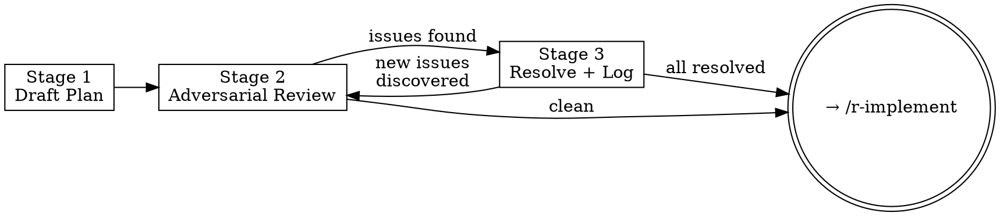

# Surveyverse Implementation Workflow

**Announce at start:** "Running implementation-workflow Stage N — [stage name]."

This skill governs implementation plan work for surveywts. Three stages, always in order:

1. **Stage 1 — Draft:** Write the implementation plan from the finalized spec
2. **Stage 2 — Review:** Adversarial batch pass; saves all issues to a file
3. **Stage 3 — Resolve:** Interactively work through issues and log decisions



<HARD-GATE>
Do not hand off to `/r-implement` until Stage 3 is complete, all issues in
`plans/plan-review-{id}.md` are resolved, and `plans/decisions-{id}.md` is
populated. No implementation begins until the plan is fully approved.
</HARD-GATE>

---

## Stage Routing

Determine which stage the user wants from context. If unclear, use the
`AskUserQuestion` tool:

```
question: "Which stage of the implementation workflow do you want to run?"
header: "Stage"
multiSelect: false
options:
  - label: "Stage 1 — Draft the plan"
    description: "Write the implementation plan from the finalized spec."
  - label: "Stage 2 — Adversarial review"
    description: "Full batch pass over the plan; saves all issues to a file."
  - label: "Stage 3 — Resolve issues"
    description: "Interactively work through the review file issue by issue."
```

Then read the corresponding reference file before doing anything else:

| Stage | Reference file |
|---|---|
| 1 | `.claude/skills/implementation-workflow/references/stage-1-draft.md` |
| 2 | `.claude/skills/implementation-workflow/references/stage-2-review.md` |
| 3 | `.claude/skills/implementation-workflow/references/stage-3-resolve.md` |

## Task Granularity (Stage 1)

Each task in the plan should be one action (2–5 minutes). TDD sub-steps must be
explicit steps, not collapsed into one: write the failing test → run to confirm
failure → write minimal code → run to confirm passing → commit. This granularity
lets r-implement work through tasks without ambiguity about what "done" means for
each step.

## Common Shortcuts to Resist

| Rationalization | Why it fails |
|---|---|
| "The plan is clear enough, Stage 2 would just nitpick" | Stage 2 catches missing error paths, wrong task order, and DRY violations before code is written. |
| "Some issues are minor, I'll resolve them later" | `plans/decisions-{id}.md` must be fully populated before handing off. |
| "We can figure out edge cases during implementation" | Edge cases discovered during implementation are plan bugs. Resolve them here. |

---

## Rules in Context

Every stage works alongside — never instead of — these rule files:

| Rule file | What it governs |
|---|---|
| `code-style.md` | Indentation, pipe, air formatter, S7 patterns, cli error structure, argument order, helper placement |
| `r-package-conventions.md` | `::` usage, NAMESPACE, roxygen2, `@return`, `@examples`, export policy |
| `surveywts-conventions.md` | Naming patterns (`get_*`, `extract_*`, `set_*`), `@family`, return visibility, haven handling |
| `testing-standards.md` | `test_that()` scope, 98% coverage, assertion patterns, data generators |
| `testing-surveywts.md` | `test_invariants()`, layer 1 vs layer 3 error testing, `make_survey_data()`, numerical tolerances |
| `github-strategy.md` | Branch naming, PR granularity, commit format, merge strategy |

---

## File Locations

The `{id}` matches the feature branch identifier (e.g., `phase-2`, `survey-srs`).

```
Implementation plan:  plans/impl-{id}.md
Plan review:          plans/plan-review-{id}.md
Decisions log:        plans/decisions-{id}.md
```
