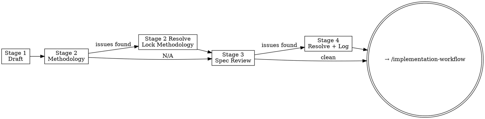

# Surveyverse Spec Workflow

**Announce at start:** "Running spec-workflow Stage N — [stage name]."

This skill governs spec work for surveywts.
Five stages, always in order:

1. **Stage 1 — Draft:** Write the spec sheet
2. **Stage 2 — Methodology Review:** Adversarial survey statistics pass; flags every
   methodological flaw before code is written *(conditional — self-assesses applicability)*
3. **Stage 2 Resolve — Lock Methodology:** Resolve all methodology issues; spec is
   methodology-locked after this
4. **Stage 3 — Spec Review:** Adversarial code-quality pass; flags gaps in contracts,
   test plans, engineering level, and API coherence (does the function behave
   as expected for every input type?)
5. **Stage 4 — Resolve:** Interactively work through all issues and log decisions

Stages 2 and 2 Resolve are conditional — skip them if the spec contains no
variance estimation, estimators, or statistical inference.



<HARD-GATE>
Do not hand off to `/implementation-workflow` until Stage 4 is complete, all issues
are resolved, and `plans/decisions-{id}.md` is populated. The spec must be
methodology-locked and code-quality-reviewed before any R code is written.
</HARD-GATE>

---

## Stage Routing

Determine which stage the user wants from context. If unclear, use the
`AskUserQuestion` tool:

```
question: "Which stage of the spec workflow do you want to run?"
header: "Stage"
multiSelect: false
options:
  - label: "Stage 1 — Draft the spec"
    description: "Write a new spec sheet from scratch."
  - label: "Stage 2 — Methodology review"
    description: "Adversarial methodology pass: statistical correctness, algorithm validity, formula integrity. Saves all issues to a file. Self-assesses applicability — declares Stage 2 not applicable and skips to Stage 3 if the feature has no mathematical content."
  - label: "Stage 2 Resolve — Resolve methodology issues"
    description: "Work through the methodology review file issue by issue. Methodology-locks the spec after completion."
  - label: "Stage 3 — Adversarial spec review"
    description: "Full batch pass over code quality, contracts, test plans, engineering level, and API coherence. Can run multiple times if new issues are discovered."
  - label: "Stage 4 — Resolve issues"
    description: "Interactively work through all open issues (from Stage 2 and/or Stage 3) and log decisions."
```

Then read the corresponding reference file before doing anything else:

| Stage | Reference file |
|---|---|
| 1 | `.claude/skills/spec-workflow/references/stage-1-draft.md` |
| 2 | `.claude/skills/spec-workflow/references/stage-2-methodology.md` |
| 2 Resolve | `.claude/skills/spec-workflow/references/stage-2-resolve.md` |
| 3 | `.claude/skills/spec-workflow/references/stage-3-review.md` |
| 4 | `.claude/skills/spec-workflow/references/stage-4-resolve.md` |

## Common Shortcuts to Resist

These are the rationalizations most likely to cause a premature handoff. Violating
the letter of the stage order is violating the spirit of it.

| Rationalization | Why it fails |
|---|---|
| "This feature has no math — Stage 2 is N/A" | Stage 2 self-assesses; don't skip it yourself. Read the reference and let it decide. |
| "The spec is clear enough, Stage 3 would just nitpick" | Stage 3 catches API coherence gaps and underspecified edge cases — not nitpicks. |
| "We can resolve that ambiguity in implementation" | Ambiguity discovered in implementation is a spec bug. Resolve it here. |
| "All issues are minor, I'll log decisions later" | `plans/decisions-{id}.md` must be populated before handing off. Log them now. |

---

## Rules in Context

Every stage works alongside — never instead of — these rule files:

| Rule file | What it governs |
|---|---|
| `code-style.md` | Indentation, pipe, air formatter, S7 patterns, cli error structure, argument order, helper placement |
| `r-package-conventions.md` | `::` usage, NAMESPACE, roxygen2, `@return`, `@examples`, export policy |
| `surveywts-conventions.md` | Package-specific naming patterns, `@family` groups, return visibility, export policy |
| `testing-standards.md` | `test_that()` scope, 98% coverage, assertion patterns, data generators |
| `testing-surveywts.md` | `test_invariants()`, layer 1 vs layer 3 error testing, data generators, numerical tolerances |

When a spec decision touches one of these rules, cite the rule file. When the
spec is silent on something these rules already define, note that the rule is
authoritative — the spec doesn't need to repeat it.

---

## File Locations

The `{id}` matches the feature branch identifier (e.g., `phase-2`, `survey-srs`).

```
Spec:                     plans/spec-{id}.md
Methodology review:       plans/spec-methodology-{id}.md
Spec review:              plans/spec-review-{id}.md
Decisions log:            plans/decisions-{id}.md
```

**Determining `{id}`:** Infer from user context first (e.g., "phase 0 spec" →
`phase-0`, "calibration spec" → `calibration`). If the spec file already exists,
derive `{id}` from its filename. If ambiguous, ask the user before reading or
writing any file.
