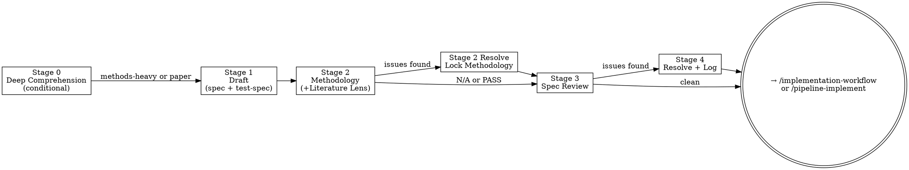

# Surveyverse Spec Workflow

**Announce at start:** "Running spec-workflow Stage N — [stage name]."

This skill governs spec work for surveywts.
Six stages, always in order:

0. **Stage 0 — Deep Comprehension:** Extract formulas, gotchas, and reference
   mappings from an attached paper or PDF *(conditional — only when methods-heavy
   or paper attached)*
1. **Stage 1 — Draft:** Write `spec-{id}.md` (behavioral contract) AND
   `test-spec-{id}.md` (validation scenarios) as two independent artifacts
2. **Stage 2 — Methodology Review:** Adversarial survey statistics pass; flags every
   methodological flaw before code is written; includes Literature Lens (Lens 6)
   when a paper was attached *(conditional — self-assesses applicability)*
3. **Stage 2 Resolve — Lock Methodology:** Resolve all methodology issues; spec is
   methodology-locked after this
4. **Stage 3 — Spec Review:** Adversarial code-quality pass; flags gaps in contracts,
   test plans, engineering level, and API coherence
5. **Stage 4 — Resolve:** Interactively work through all issues and log decisions

Stage 0 is conditional — only run when the feature involves statistical methods or
a paper has been attached.
Stages 2 and 2 Resolve are conditional — skip them if the spec contains no
variance estimation, estimators, or statistical inference.


```dot
digraph spec_stages {
    rankdir=LR;
    S0 [label="Stage 0\nDeep Comprehension\n(conditional)", shape=box];
    S1 [label="Stage 1\nDraft\n(spec + test-spec)", shape=box];
    S2 [label="Stage 2\nMethodology\n(+Literature Lens)", shape=box];
    S2R [label="Stage 2 Resolve\nLock Methodology", shape=box];
    S3 [label="Stage 3\nSpec Review", shape=box];
    S4 [label="Stage 4\nResolve + Log", shape=box];
    done [label="→ /implementation-workflow\nor /pipeline-implement", shape=doublecircle];

    S0 -> S1 [label="methods-heavy or paper"];
    S1 -> S2;
    S2 -> S2R [label="issues found"];
    S2 -> S3 [label="N/A or PASS"];
    S2R -> S3;
    S3 -> S4 [label="issues found"];
    S3 -> done [label="clean"];
    S4 -> done;
}
```

<HARD-GATE>
Do not hand off to `/implementation-workflow` until Stage 4 is complete, all issues
are resolved, and `plans/decisions-{id}.md` is populated. The spec must be
methodology-locked and code-quality-reviewed before any R code is written.
</HARD-GATE>

---

## Stage Routing

Determine which stage the user wants from context. If unclear, use the
`AskUserQuestion` tool:

```
question: "Which stage of the spec workflow do you want to run?"
header: "Stage"
multiSelect: false
options:
  - label: "Stage 0 — Deep Comprehension (paper/methods-heavy)"
    description: "Extract formulas, gotchas, and reference mappings from an attached paper or PDF. Produces comprehension.md before drafting begins."
  - label: "Stage 1 — Draft spec + test-spec"
    description: "Write spec-{id}.md (behavioral contract) and test-spec-{id}.md (validation scenarios) as two independent artifacts."
  - label: "Stage 2 — Methodology review"
    description: "Adversarial methodology pass: statistical correctness, algorithm validity, formula integrity. Includes Literature Lens if a paper was attached. Self-assesses applicability."
  - label: "Stage 2 Resolve — Resolve methodology issues"
    description: "Work through the methodology review file issue by issue. Methodology-locks the spec after completion."
  - label: "Stage 3 — Adversarial spec review"
    description: "Full batch pass over code quality, contracts, test plans, engineering level, and API coherence."
  - label: "Stage 4 — Resolve issues"
    description: "Interactively work through all open issues (from Stage 2 and/or Stage 3) and log decisions."
```

Then read the corresponding reference file before doing anything else:

| Stage | Reference file |
|-------|---------------|
| 0 | `.claude/skills/spec-workflow/references/stage-0-comprehension.md` |
| 1 | `.claude/skills/spec-workflow/references/stage-1-draft.md` |
| 2 | `.claude/skills/spec-workflow/references/stage-2-methodology.md` |
| 2 Resolve | `.claude/skills/spec-workflow/references/stage-2-resolve.md` |
| 3 | `.claude/skills/spec-workflow/references/stage-3-review.md` |
| 4 | `.claude/skills/spec-workflow/references/stage-4-resolve.md` |

## Common Shortcuts to Resist

These are the rationalizations most likely to cause a premature handoff. Violating
the letter of the stage order is violating the spirit of it.

| Rationalization | Why it fails |
|---|---|
| "This feature has no math — Stage 2 is N/A" | Stage 2 self-assesses; don't skip it yourself. Read the reference and let it decide. |
| "The spec is clear enough, Stage 3 would just nitpick" | Stage 3 catches API coherence gaps and underspecified edge cases — not nitpicks. |
| "We can resolve that ambiguity in implementation" | Ambiguity discovered in implementation is a spec bug. Resolve it here. |
| "All issues are minor, I'll log decisions later" | `plans/decisions-{id}.md` must be populated before handing off. Log them now. |

---

## Rules in Context

These standards files live in `.claude/standards/` and do **not** auto-load.
Read the one you need before a stage relies on it — do not assume it is
already in context:

| Standards file | What it governs |
|---|---|
| `.claude/standards/code-style.md` | Indentation, pipe, air formatter, S7 patterns, cli error structure, argument order, helper placement |
| `.claude/standards/r-package-conventions.md` | `::` usage, NAMESPACE, roxygen2, `@return`, `@examples`, export policy |
| `.claude/standards/surveywts-conventions.md` | Package-specific naming patterns, `@family` groups, return visibility, export policy |
| `.claude/standards/function-documentation.md` | Tier system (Utility / Standard / Algorithmic / Dispatcher), `@param` / `@returns` / `@details` / `@section` rules, `@examples` constraints, mathematical notation |
| `.claude/standards/testing-standards.md` | `test_that()` scope, 98% coverage, assertion patterns, data generators |
| `.claude/standards/testing-surveywts.md` | `test_invariants()`, layer 1 vs layer 3 error testing, data generators, numerical tolerances |

When a spec decision touches one of these rules, read the file and cite it.
When the spec is silent on something a standards file already defines, note
that the rule is authoritative — the spec doesn't need to repeat it.

---

## File Locations

The `{id}` matches the feature branch identifier (e.g., `phase-2`, `survey-srs`).

```
Spec:                     plans/spec-{id}.md
Methodology review:       plans/spec-methodology-{id}.md
Spec review:              plans/spec-review-{id}.md
Decisions log:            plans/decisions-{id}.md
```

**Determining `{id}`:** Infer from user context first (e.g., "phase 0 spec" →
`phase-0`, "calibration spec" → `calibration`). If the spec file already exists,
derive `{id}` from its filename. If ambiguous, ask the user before reading or
writing any file.
