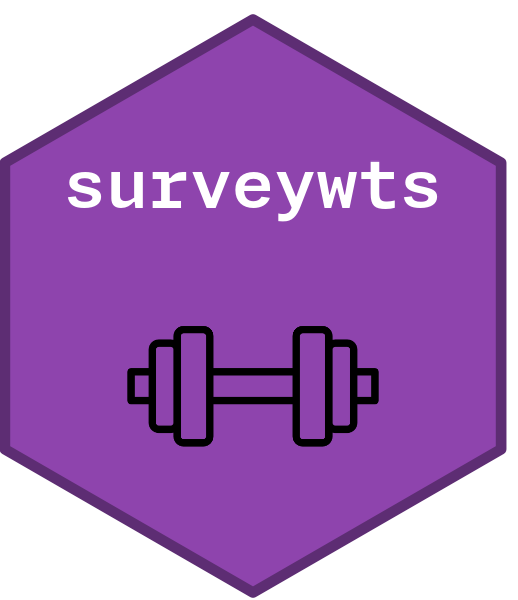

<!-- README.md is generated from README.Rmd. Please edit that file -->

# surveywts <a href = "https://jdenn0514.github.io/surveywts/index.html"></a>

<!-- badges: start -->

[](https://github.com/JDenn0514/surveywts/actions/workflows/R-CMD-check.yaml)
[](https://app.codecov.io/gh/JDenn0514/surveywts?branch=main)
[](https://jdenn0514.r-universe.dev/surveywts)
<!-- badges: end -->

surveywts provides tidy tools for calibrating survey weights to known
population totals, adjusting for nonresponse, and diagnosing weight
quality — all with full weighting history tracking for reproducible
survey analysis.

## Installation

``` r
# From GitHub (development version)
pak::pak("JDenn0514/surveywts")

# From r-universe (pre-built binaries, no GitHub PAT needed)
install.packages("surveywts", repos = "https://jdenn0514.r-universe.dev")
```

## Overview

surveywts is part of the [surveyverse](https://github.com/JDenn0514)
ecosystem. It provides three calibration methods, nonresponse
adjustment, and weight diagnostics — all using tidy, formula-free
syntax.

| Function | Purpose |
|----|----|
| `calibrate()` | GREG calibration to population totals |
| `rake()` | Raking (iterative proportional fitting) |
| `poststratify()` | Post-stratification to cell counts or proportions |
| `adjust_nonresponse()` | Nonresponse adjustment via weighting classes |
| `effective_sample_size()` | ESS (Kish approximation) |
| `weight_variability()` | CV and design effect of weights |
| `summarize_weights()` | Summary statistics, optionally by group |

Every function tracks the full weighting history so you can audit
exactly what transformations were applied and in what order.

## Usage

``` r
library(surveywts)
```

## Learn more

Full documentation is available at
<https://jdenn0514.github.io/surveywts/>.
